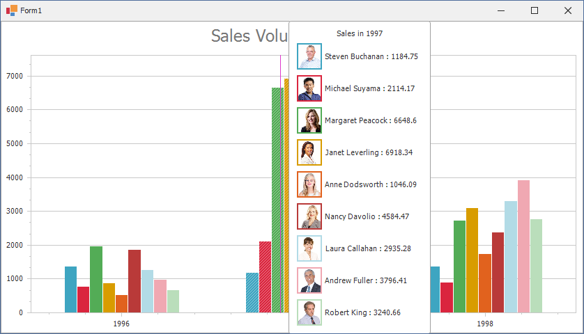

<!-- default badges list -->

<!-- default badges end -->

# Chart for WinForms - Draw a Custom Series Marker in the Crosshair

This example demonstrates how to use the [CustomDrawCrosshair](https://docs.devexpress.com/WindowsForms/DevExpress.XtraCharts.ChartControl.CustomDrawCrosshair?v=22.2&p=netframework) event to modify the legend markers of bar series.

To access crosshair element groups, use the&nbsp;<a href="https://documentation.devexpress.com/#CoreLibraries/DevExpressXtraChartsCustomDrawCrosshairEventArgs_CrosshairElementGroupstopic">CustomDrawCrosshairEventArgs.CrosshairElementGroups</a>&nbsp;property. Elements&nbsp;are divided into several groups when crosshair labels are displayed for each pane. Use the following properties to access crosshair elements and customize them:

- [HeaderElement](https://docs.devexpress.com/CoreLibraries/DevExpress.XtraCharts.CrosshairElementGroup.HeaderElement) 
- [CrosshairElements](https://docs.devexpress.com/CoreLibraries/DevExpress.XtraCharts.CrosshairElementGroup.CrosshairElements)
- [MarkerImage](https://docs.devexpress.com/CoreLibraries/DevExpress.XtraCharts.CrosshairLabelElement.MarkerImage)

## Files to Review

* **[Form1.cs](./CS/CustomDrawCrosshairSample/Form1.cs) (VB: [Form1.vb](./VB/CustomDrawCrosshairSample/Form1.vb))**
* [Employee.cs](./CS/CustomDrawCrosshairSample/Model/Employee.cs) (VB: [Employee.vb](./VB/CustomDrawCrosshairSample/Model/Employee.vb))
* [NwindDbContext.cs](./CS/CustomDrawCrosshairSample/Model/NwindDbContext.cs) (VB: [NwindDbContext.vb](./VB/CustomDrawCrosshairSample/Model/NwindDbContext.vb))
* [Order.cs](./CS/CustomDrawCrosshairSample/Model/Order.cs) (VB: [Order.vb](./VB/CustomDrawCrosshairSample/Model/Order.vb))

## Documentation

[Tooltip and Crosshair Cursor](https://docs.devexpress.com/WindowsForms/11976/controls-and-libraries/chart-control/end-user-features/tooltip-and-crosshair-cursor?p=netframework)

<!-- feedback -->
## Does this example address your development requirements/objectives?

 

(you will be redirected to DevExpress.com to submit your response)
<!-- feedback end -->
